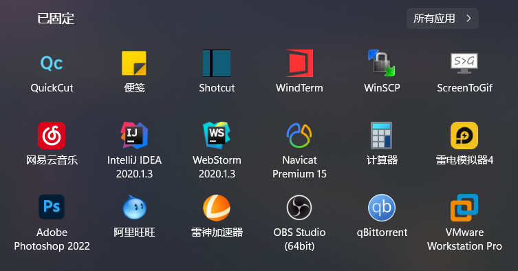

# Windows设置及软件清单
避免每次装机重头寻找历史安装过的软件，索性列一个清单，炼成半小时装机软件复原大法

<details><summary>关闭VBS</summary>

```shell
设置 —— 更新和安全 —— Windows安全中心 —— 设备安全性 —— 内核隔离详细信息 —— 内存完整性
```

```powershell
bcdedit /set hypervisorlaunchtype off
```

</details>

<details><summary>关闭虚拟内存</summary>

```shell
设置 —— 系统 —— 关于 —— 高级系统设置 —— 性能设置 —— 高级 —— 虚拟内存 —— 更改 —— 无分页文件 —— 设置并确定
```
</details>
	
<details><summary>关闭休眠模式</summary>

```shell
powercfg -h off
```
</details>

<details><summary>CPU核数设置</summary>

```shell
msconfig
```
</details>

<details><summary>卓越性能电源计划</summary>

```shell
powercfg -duplicatescheme e9a42b02-d5df-448d-aa00-03f14749eb61
```
</details>

<details><summary>一键解除所有UWP应用的网络隔离（CMD指令/PowerShell指令）</summary>

[Windows Loopback Exemption Manager](https://github.com/tiagonmas/Windows-Loopback-Exemption-Manager)(微软官方出品)、[Windows 8 AppContainer Loopback Utility](https://www.telerik.com/fiddler/add-ons)(第三方软件)

```cmd
FOR /F "tokens=11 delims=\" %p IN ('REG QUERY "HKCU\Software\Classes\Local Settings\Software\Microsoft\Windows\CurrentVersion\AppContainer\Mappings"') DO CheckNetIsolation.exe LoopbackExempt -a -p=%p
```

```powershell
Get-ChildItem -Path Registry::"HKCU\Software\Classes\Local Settings\Software\Microsoft\Windows\CurrentVersion\AppContainer\Mappings\" -name | ForEach-Object {CheckNetIsolation.exe LoopbackExempt -a -p="$_"}
```
</details>

<details><summary>WSL2代理设置</summary>

```shell
$ sudo vim ~./bashrc

# export windows_host=`cat /etc/resolv.conf|grep nameserver|awk '{print $2}'`
# export ALL_PROXY="socks5://$windows_host:2080"

# alias setproxy="export ALL_PROXY=socks5://$windows_host:2080" 
# alias unsetproxy="unset ALL_PROXY"

git clone https://github.com/rofl0r/proxychains-ng
cd proxychains-ng
sudo apt install build-essential
./configure --prefix=/usr --sysconfdir=/etc
make && make install
make install-config
```

```shell
$ sudo vim /etc/proxychains.conf

quiet_mode
dynamic_chain
chain_len = 1
proxy_dns
remote_dns_subnet 224
tcp_read_time_out 15000
tcp_connect_time_out 8000
localnet 127.0.0.0/255.0.0.0
localnet 10.0.0.0/255.0.0.0
localnet 172.16.0.0/255.240.0.0
localnet 192.168.0.0/255.255.0.0

[ProxyList]
socks5  $windows_host 2080
# http    $windows_host 2081
```
</details>

<details><summary>CMD/PowerShell代理设置</summary>

```cmd
set http_proxy=http://127.0.0.1:2081
set https_proxy=http://127.0.0.1:2081
```

```powershell
$env:http_proxy="http://127.0.0.1:2081"
$env:https_proxy="http://127.0.0.1:2081"
```
</details>

<details><summary>git代理设置</summary>

```shell
# ssh代理配置文件路径：C:/Users/username/.ssh/config
Host github.com
    ProxyCommand connect -S localhost:2080 %h %p

# 指令的方式直接增加代理设置
git config --global http.https://github.com.proxy socks5://127.0.0.1:2080

# git配置文件路径：C:/Users/username/.gitconfig
[http "https://github.com"]
	proxy = socks5://127.0.0.1:2080
```
</details>

<details><summary>git log美化</summary>

```shell
git config --global alias.lg "log --color --graph --abbrev-commit --decorate --date=relative --format=format:'%C(bold blue)%h%C(reset) - %C(bold green)(%ar)%C(reset) %C(white)%s%C(reset) %C(dim white)- %an%C(reset)%C(bold yellow)%d%C(reset)' --all"
```
</details>

<details><summary>git GPG相关设置</summary>

```shell
git config --global user.signingkey <密钥ID>
git config --global commit.gpgsign true
git config --global tag.forcesignannotated true
```
</details>

<details><summary>pip代理功能稀烂，建议换阿里源</summary>

```shell
pip config set global.index-url https://mirrors.aliyun.com/pypi/simple/
pip config set install.trusted-host mirrors.aliyun.com

# pip全局配置文件路径：C:/Users/username/AppData/Roaming/pip/pip.ini
[global]
index-url = https://mirrors.aliyun.com/pypi/simple/
# proxy=http://127.0.0.1:2081
[install]
trusted-host = mirrors.aliyun.com
```
</details>

<details><summary>npm、yarn的代理/换源设置</summary>

```shell
npm config set proxy http://127.0.0.1:2081
npm config set https-proxy http://127.0.0.1:2081
npm config set registry https://registry.npmmirror.com

yarn config set proxy http://127.0.0.1:2081
yarn config set https-proxy http://127.0.0.1:2081
yarn config set registry https://registry.npmmirror.com
```
</details>

<details><summary>golang代理设置</summary>

```shell
go env -w GO111MODULE=on
go env -w GOPROXY=https://mirrors.aliyun.com/goproxy/
```
</details>

<details><summary>GPG常用指令及配置文件</summary>

```shell
gpg --expert --full-generate-key # 生成密钥
gpg -ao revoke.pgp --generate-revocation <密钥ID> # 生成撤销凭证
gpg --list-keys/-k # 列出所有公钥
gpg --list-secret-keys/-K # 列出所有私钥

gpg --edit-key <密钥ID>
gpg> list # 列出所有子密钥
gpg> key {n} # 选择序号为n的子密钥
gpg> trust # 设置信任度
gpg> expire # 设置过期时间
gpg> passwd # 更改密码
gpg> revkey # 撤销子密钥
gpg> save # 保存

gpg -ao public-key.asc --export <密钥ID> # 导出公钥
# 密钥ID后要加上"!", 不然会导出全部子密钥
gpg -ao secret-key.asc --export-secret-key <密钥ID>! # 导出主私钥
gpg -ao sign-subkey.asc --export-secret-subkeys <密钥ID>! # 导出子私钥

gpg --delete-secret-keys <密钥ID> # 删除私钥
gpg --delete-keys <密钥ID> # 删除公钥

gpg --import [密钥文件/撤销凭证] # 导入密钥

gpg --sign input.txt  # 给文档签名
gpg --clear-sign input.txt # 生成ASCII格式签名
gpg -ao output.asc --detach-sign input.txt # 签名和原文本分开
gpg --verify output.asc input.txt # 验证签名文件
	
gpg -ao output.asc -se input.txt -r <公钥ID> # 签名并加密文档
# s代表签名, e代表加密, r代表recipient, 指定接收者的公钥ID, a代表ASCII码格式, o代表输出地址, 
gpg -ao input.txt -d output.asc # 解密	
```

```shell
C:/Users/username/.gnupg/gpg.conf

keyid-format 0xlong
with-fingerprint
personal-cipher-preferences AES256
personal-digest-preferences SHA512
personal-compress-preferences Uncompressed
default-preference-list SHA512 AES256 Uncompressed
cert-digest-algo SHA512
s2k-cipher-algo AES256
s2k-digest-algo SHA512
s2k-mode 3
s2k-count 65011712
```
</details>

<details><summary>Chrome & Edge Flags</summary>

```shell
Smooth Scrolling
WebAssembly lazy compilation
Enable system notifications.
【Chrome Only】Password import
Parallel downloading
Tab Hover Card Images
【Chrome Only】Desktop Sharing Hub in Omnibox
【Chrome Only】Windows 11 Style Menus
【Edge Only】Microsoft Edge Share Menu
【Edge Only】Windows style overlay scrollbars.
【Edge Only】Enable Windows 11 Visual Updates
```
</details>

<details><summary>youtube-dl设置</summary>

设置文件目录：C:/Users/username/youtube-dl.conf

```shell
--ignore-errors
--external-downloader aria2c
--external-downloader-args "-s 16 -x 16 -k 1M"
--proxy http://127.0.0.1:2081/
# --proxy socks5://127.0.0.1:2080/ 直播推流不支持socks5
--hls-prefer-ffmpeg
-f 'bestvideo[ext=mp4]+bestaudio[ext=m4a]/best[ext=mp4]/best'
-o V:/Videos/"%(uploader)s(%(uploader_id)s)/%(upload_date)s-%(title)s-(%(duration)ss)[%(resolution)s][%(id)s].%(ext)s"
--add-metadata
--write-description
--write-thumbnail
```
</details>

<details><summary>IntelliJ IDEA设置备忘录</summary>

```shell
【IntelliJ IDEA启动参数】
文件目录：~\JetBrains\IntelliJIDEA\bin\idea64.exe.vmoptions
-Xms2048m
-Xmx2048m
-XX:ReservedCodeCacheSize=1024m
【皮肤设置】
Appearance & Behavior —— Appearance —— Theme：One Dark vivid
【启动IDEA时不自动打开项目】
Appearance & Behavior —— System Settings —— × Reopen last project on startup
【代理设置】
Appearance & Behavior —— System Settings —— HTTP Proxy —— Manual proxy configuration —— √ HTTP ; Host name：127.0.0.1 ; Port number：2081
【滚轮修改字体大小】
Editor —— General —— √ Change font size(Zoom) with Ctrl+Mouse Wheel
Editor —— General —— Scrolling —— √ Enable smooth scrolling (default on 2021.1.2) —— Move caret, minimize editor scrolling
【自动导包】[项目设置]
Editor —— General —— Auto Import —— Insert imports on paste：Always (default on 2021.1.2) ; √ Add Unambiguous imports on the fly ; √ Optimize imports on the fly
【设置行号显示】
Editor —— General —— Appearance —— √ Show line numbers (default on 2021.1.2) ; √ Show method separators
【忽略大小写】
Editor —— General —— Code Completion —— × Match case
【取消单行显示标签页】
Editor —— General —— Editor Tabs —— Show tabs in Multiple rows —— √ Show pinned tabs in a separate row
【悬浮提示】
Editor —— Code Editing —— √ Show quick documentation on mouse move (default on 2021.1.2)
【字体】
Editor —— Font —— Font: JetBrains Mono —— Size: 13 —— Line height: 1.2 (default on 2021.1.2)
Editor —— Font —— Fallback font：Sarasa Mono Slab SC
【自动换行】
Editor —— Code Style —— √ Wrap on typing 
Editor —— Code Style —— Java —— Wrapping and Braces —— √ Ensure right margin is not exceeded
【单行注释斜杠跟着代码】
Editor —— Code Style —— Java —— Code Generation —— × Line comment at first column ; √ Add a space at comment start
【项目文件编码】[项目设置]
Editor —— File Encodings —— Global Encoding: UTF-8 ; Project Encoding: UTF-8 ; Default encoding for properties files: UTF-8 ; √ Transparent native-to-ascii conversion
【插件列表】
Plugins —— Lombok ; One Dark theme ; Rainbow Brackets ; Translation ; Maven Helper ; RestfulTool ; MybatisX ; 
【自动编译项目】[项目设置]
Build, Execution, Deployment —— Compiler —— √ Build project automatically
【增加堆内存】[项目设置]
Build, Execution, Deployment —— Compiler —— Build process heap size(Mbytes): 2048
【翻译设置】
Tools —— Translation —— 常规 —— √ 使用translate.google.com ; —— 字体 —— 主要字体: Sarasa Mono Slab SC ; 音标字体: Sarasa Mono Slab SC
```

```shell
Code Style(schemes)
CodeInsight, DefaultFont, Editor, Error highlighting
Default Project[项目设置]
Editor Colors
General
HTTP Proxy
KotlinCodeInsightSettings
Settings
UI Settings

codestyles
- Default.xml
options
- colors.scheme.xml
- editor.codeinsight.xml
- editor.xml
- ide.general.xml
- project.default.xml[项目设置]
- proxy.settings.xml
- ui.lnf.xml
- yiiguxing.translation.xml
```
</details>

## Useful Websites

- [UUP dump](https://uupdump.ml/?lang=zh-cn)
- [423Down](https://www.423down.com/)
- [果核剥壳](https://www.ghpym.com/)
- [远景论坛](http://bbs.pcbeta.com/forum-win10-1.html)

## Software List(Indispensable)

- [微软常用运行库](https://www.ghpym.com/yxkhj.html)、[Alter version](https://github.com/abbodi1406/vcredist/releases)
- [HEU KMS Activator](https://www.423down.com/1202.html)
- [Netch](https://github.com/NetchX/Netch/releases)
- [v2rayN](https://github.com/2dust/v2rayN/releases)
- [搜狗输入法](https://pinyin.sogou.com/)
- [Bandizip](https://www.bandisoft.com/bandizip/dl/)、[patch](https://www.423down.com/9735.html)、[7-Zip](https://www.7-zip.org/)、[NanaZip](https://github.com/M2Team/NanaZip/releases)
- [Chrome](https://www.google.com/intl/zh-CN/chrome/browser/thankyou.html?platform=win64&standalone=1&statcb=1&installdataindex=defaultbrowser)、[FireFox](https://www.mozilla.org/zh-CN/firefox/all/#product-desktop-release)
- [Typora](https://typora.io/)
- [Visual Studio Code](https://code.visualstudio.com/)
- [火绒](https://www.huorong.cn/person5.html)
- [Logitech G HUB](https://support.logi.com/hc/zh-cn/articles/360025298133)
- [Intel Graphics Driver](https://www.intel.cn/content/www/cn/zh/products/sku/88967/intel-core-i76700hq-processor-6m-cache-up-to-3-50-ghz/downloads.html)、[alter](https://www.intel.cn/content/www/cn/zh/download/19344/intel-graphics-windows-dch-drivers.html)
- [GeForce Drivers](https://www.nvidia.cn/geforce/drivers/)
- [Realtek High Definition Audio (HDA) Version WHQL](https://www.necacom.net/index.php/realtek/hda/)
- [Intel Wi-Fi 6 AX200 (Gig+) Driver](https://www.intel.cn/content/www/cn/zh/products/sku/189347/intel-wifi-6-ax200-gig/downloads.html)、[alter](https://www.intel.cn/content/www/cn/zh/download/19351/windows-10-and-windows-11-wi-fi-drivers-for-intel-wireless-adapters.html)、[alter2](https://www.intel.cn/content/www/cn/zh/download/18649/intel-wireless-bluetooth-for-windows-10.html?)
- [nvidiaProfileInspector](https://github.com/Orbmu2k/nvidiaProfileInspector/releases/)
- [DriverStoreExplorer](https://github.com/lostindark/DriverStoreExplorer/releases)
- [TrafficMonitor](https://github.com/zhongyang219/TrafficMonitor/releases)
- [OpenHashTab](https://github.com/namazso/OpenHashTab/releases)
- [Everything](https://www.voidtools.com/zh-cn/downloads/)
- [Office Tool Plus](https://github.com/YerongAI/Office-Tool/releases)
- [QQ](https://im.qq.com/download/)、[NtrQQ](https://github.com/NtrQQ/download/releases)、[iYa.App 软件交流社区](https://iya.app/)
- [Steam](https://store.steampowered.com/about/)
- [Ubisoft Connect](https://ubisoftconnect.com/zh-CN/)
- [Groupy](https://store.steampowered.com/app/912170)
- [Start10](https://store.steampowered.com/app/620050/Start10)
- [QuickCut](https://github.com/HaujetZhao/QuickCut)、[格式工厂](https://www.423down.com/1072.html)、[XMedia Recode](https://www.xmedia-recode.de/en/download_64bit.php)、[ShanaEncoder](https://shana.pe.kr/shanaencoder_download)
- [Microsoft Sticky Notes](https://www.microsoft.com/en-us/p/microsoft-sticky-notes/9nblggh4qghw)
- [Shotcut](https://github.com/mltframework/shotcut/releases)
- [ScreenToGif](https://github.com/NickeManarin/ScreenToGif/releases)
- [网易云音乐](https://music.163.com/#/download)
- [Windows Calculator](https://www.microsoft.com/en-us/p/windows-calculator/9wzdncrfhvn5)
- [WinSW](https://github.com/winsw/winsw/releases)
- [UnblockNeteaseMusic](https://github.com/UnblockNeteaseMusic/server/releases)
- [aria2](https://github.com/aria2/aria2/releases)
- [FFmpeg(GPL ver.)](https://github.com/BtbN/FFmpeg-Builds/releases)
- [youtube-dl](https://github.com/ytdl-org/youtube-dl/releases)
- [Snipaste](https://www.snipaste.com/)
- [PotPlayer](https://potplayer.daum.net/)
- [Honeyview](http://www.bandisoft.com/honeyview/)
- [K-Lite Codec Pack Mega](http://www.codecguide.com/download_k-lite_codec_pack_mega.htm)
- [阿里旺旺](https://alimarket.taobao.com/markets/qnww/portal-group/ww/download)
- [Adobe software series](https://weibo.com/1112829033)
- [百度云](http://pan.baidu.com/download)
- [CCleaner](https://www.423down.com/716.html)、[Winapp2](https://github.com/MoscaDotTo/Winapp2)
- [XMind](https://www.ghpym.com/xmindzen.html)
- [Telegram](https://telegram.org/)
- [天翼云盘](https://cloud.189.cn/download_client.jsp)
- [雷神加速器](https://jiasu.nn.com/)
- [雷电安卓模拟器](https://www.ldmnq.com/)
- [qBittorrent-Enhanced-Edition](https://github.com/c0re100/qBittorrent-Enhanced-Edition/releases)
- [微信](https://www.423down.com/8718.html)
- 来自设备制造商的 HEVC 视频扩展(ms-windows-store://pdp/?ProductId=9n4wgh0z6vhq)

## Software List(Optional)

- [BilibiliLiveRecordDownLoader](https://github.com/HMBSbige/BilibiliLiveRecordDownLoader/releases)
- [EmEditor](https://www.423down.com/7569.html)
- [Fences](https://store.steampowered.com/app/607380)
- [AIDA64](https://www.423down.com/887.html)
- [AS SSD Benchmark](https://www.423down.com/6751.html)
- [Cheat Engine](https://cheatengine.org/)
- [CPU-Z](https://www.cpuid.com/softwares/cpu-z.html)
- [DISM++](http://www.chuyu.me/zh-Hans/index.html)、[wsusscn3.cab](https://github.com/Chuyu-Team/Dism-Multi-language/releases)
- [Fiddler Everywhere](https://www.telerik.com/download/fiddler-everywhere)、[Fiddler Classic](https://www.telerik.com/download/fiddler)
- [Waifu2x-Extension-GUI](https://github.com/AaronFeng753/Waifu2x-Extension-GUI/releases)
- [Open Broadcaster Software](https://obsproject.com/download)
- [UltraISO](https://www.ghpym.com/ultraiso.html)
- [drawio](https://github.com/jgraph/drawio)
- [VMware Workstation](https://www.ghpym.com/workstationlite.html)
- [rufus](https://github.com/pbatard/rufus/releases)
- [Realtek Audio Control(UWP)](https://www.microsoft.com/zh-cn/p/realtek-audio-control/9p2b8mcsvpln)(Only valid when the UAD version of the driver is installed)
- [Resilio Sync](https://www.resilio.com/platforms/desktop/)
- [SteamAchievementManager](https://github.com/gibbed/SteamAchievementManager/releases)、[SAM-Auto](https://github.com/unencouraged/SAM-Auto/releases)
- [CrystalDiskInfo & CrystalDiskMark](https://crystalmark.info/en/download/)
- [GPU-Z](https://www.423down.com/3675.html)
- [NatTypeTester](https://github.com/HMBSbige/NatTypeTester/releases)
- [SSD-Z](https://www.423down.com/4748.html)
- 显示器色域检测v2.2.1(图拉丁版)
- [BestTrace](https://www.ipip.net/product/client.html)

#### Drivers

- [Driver Booster](https://www.423down.com/10421.html)
- [驱动人生](https://www.423down.com/581.html)
- [驱动精灵](https://www.423down.com/5768.html)
- [360驱动大师](https://www.423down.com/9157.html)

#### Recovery

- [7-Data Recovery Suite](https://www.423down.com/2721.html)
- [EasyRecovery](https://www.423down.com/7904.html)
- [R-STUDIO Network](https://www.423down.com/8132.html)
- [DiskGenius](https://www.423down.com/8073.html)

## Developer Tools

- [Temurin](https://adoptium.net/)、[Oracle JDK](https://www.oracle.com/java/technologies/downloads/)、[Zulu](https://www.azul.com/downloads/)
- [Windows Terminal](https://github.com/microsoft/terminal/releases)
- [gsudo](https://github.com/gerardog/gsudo)
- [Termius](https://www.termius.com/windows)、[patch](https://www.52pojie.cn/thread-1303401-1-1.html)
- [WinSCP](https://winscp.net/eng/download.php)
- [IntelliJ IDEA](https://www.jetbrains.com/idea/download/#section=windows)、[JetBrains Mono](https://www.jetbrains.com/lp/mono/)、[patch](https://zhile.io/)
- [PuTTY](https://www.chiark.greenend.org.uk/~sgtatham/putty/latest.html)
- [git](https://github.com/git-for-windows/git/releases)
- [AnotherRedisDesktopManager](https://github.com/qishibo/anotherredisdesktopmanager/releases)
- [Process Monitor](https://docs.microsoft.com/en-us/sysinternals/downloads/procmon)
- [Autoruns](https://docs.microsoft.com/zh-cn/sysinternals/downloads/autoruns)
- [WinDbg Preview](https://docs.microsoft.com/en-us/windows-hardware/drivers/debugger/debugger-download-tools)
- [jadx](https://github.com/skylot/jadx/releases)、[bytecode-viewer](https://github.com/Konloch/bytecode-viewer/releases)、[cfr](https://github.com/leibnitz27/cfr/releases)、[pyinstxtractor](https://github.com/extremecoders-re/pyinstxtractor)、[python-uncompyle6](https://github.com/rocky/python-uncompyle6/releases)
- [Navicat Premium](https://www.ghpym.com/navicat.html)
- [Node.js](https://nodejs.org/zh-cn/download/)
- [Yarn](https://classic.yarnpkg.com/en/docs/install/#windows-nightly)
- [Python](https://www.python.org/downloads/)
- [MySQL](https://dev.mysql.com/downloads/windows/installer/5.7.html)
- [Apktool](https://ibotpeaches.github.io/Apktool/install/)、[Apktool](https://github.com/iBotPeaches/Apktool/releases)
- [PowerShell](https://github.com/PowerShell/PowerShell/releases)
- [TDM-GCC](https://jmeubank.github.io/tdm-gcc/)
- [Gpg4win](https://www.gpg4win.org/)

## 任务栏布局




## Chrome Extensions

#### Skin

- [When the Night Falls (yellow neon; with rain)](https://chrome.google.com/webstore/detail/when-the-night-falls-yell/dhdibmnepnffnnlgldgkdembnmnhmdbc)

#### Pinned

- [Tree Style History](https://github.com/tumuyan/Tree-Style-History)
- [Tab Muter](https://github.com/sersorrel/mute-tab)
- [哔哩哔哩助手](https://github.com/bilibili-helper/bilibili-helper-o)
- [FireShot](https://chrome.google.com/webstore/detail/take-webpage-screenshots/mcbpblocgmgfnpjjppndjkmgjaogfceg)
- [uBlock Origin](https://github.com/gorhill/uBlock)
- [RSS Reader Extension (by Inoreader)](https://chrome.google.com/webstore/detail/rss-reader-extension-by-i/kfimphpokifbjgmjflanmfeppcjimgah)
- [贴吧签到助手](https://chrome.google.com/webstore/detail/bpheclmhommpomjoeoifcggjmdelgaoj)
- [Twitter Media Downloader](https://chrome.google.com/webstore/detail/twitter-media-downloader/cblpjenafgeohmnjknfhpdbdljfkndig)
- [EditThisCookie](https://github.com/ETCExtensions/Edit-This-Cookie)
- [SingleFile](https://github.com/gildas-lormeau/SingleFile)
- [魂签](https://github.com/inu1255/soulsign-chrome)
- [Stylus](https://github.com/openstyles/stylus)
- [Violentmonkey](https://github.com/violentmonkey/violentmonkey)

#### Unpinned

- [Adobe Acrobat](https://chrome.google.com/webstore/detail/adobe-acrobat/efaidnbmnnnibpcajpcglclefindmkaj)
- [Augmented Steam](https://github.com/tfedor/AugmentedSteam)
- [EhSyringe](https://github.com/EhTagTranslation/EhSyringe)
- [Git Master](https://github.com/ineo6/git-master)
- [IDM Integration Module](https://chrome.google.com/webstore/detail/idm-integration-module/ngpampappnmepgilojfohadhhmbhlaek)
- [mirigana](https://github.com/mirigana/mirigana)
- [Refined GitHub](https://github.com/refined-github/refined-github)
- [ScrollAnywhere](https://chrome.google.com/webstore/detail/scrollanywhere/jehmdpemhgfgjblpkilmeoafmkhbckhi)
- [Show YouTube comments while watching](https://github.com/tanguykurylo/show-youtube-comments)
- [Steam Database](https://github.com/SteamDatabase/BrowserExtension)
- [TabCopy](https://chrome.google.com/webstore/detail/tabcopy/micdllihgoppmejpecmkilggmaagfdmb)
- [WebRTC Leak Prevent](https://github.com/aghorler/WebRTC-Leak-Prevent)
- [YouTube Live Chat Flow](https://github.com/fiahfy/youtube-live-chat-flow/releases)
- [购物党自动比价工具](https://chrome.google.com/webstore/detail/%E8%B4%AD%E7%89%A9%E5%85%9A%E8%87%AA%E5%8A%A8%E6%AF%94%E4%BB%B7%E5%B7%A5%E5%85%B7/jgphnjokjhjlcnnajmfjlacjnjkhleah)

#### Not Using

- ~~[Bookmark Sidebar](https://github.com/Kiuryy/Bookmark_Sidebar)~~
- ~~[FeHelper](https://github.com/zxlie/FeHelper)~~
- ~~[Octoman微博备份](https://github.com/misswell/octoman-weibo-backup)~~
- ~~[Similar Sites](https://chrome.google.com/webstore/detail/similar-sites-discover-re/necpbmbhhdiplmfhmjicabdeighkndkn)~~
- ~~[Steam Inventory Helper](https://chrome.google.com/webstore/detail/steam-inventory-helper/cmeakgjggjdlcpncigglobpjbkabhmjl)~~
- ~~[Tampermonkey](https://chrome.google.com/webstore/detail/tampermonkey/dhdgffkkebhmkfjojejmpbldmpobfkfo)~~
- ~~[uBlacklist](https://github.com/iorate/uBlacklist)、[中文搜索结果黑名单](https://github.com/cobaltdisco/Google-Chinese-Results-Blocklist)~~
- ~~[Wrona History Menu](https://github.com/lajw/history-menu)~~

<details><summary>字体及美化</summary>

- [更纱黑体(Iosevka+思源黑体)](https://github.com/be5invis/Sarasa-Gothic/releases)
- [JetBrainsMono](https://github.com/JetBrains/JetBrainsMono/releases)
- [阿里巴巴普惠体](https://done.alibabadesign.com/puhuiti2.0)
- [致美化](https://zhutix.com/)
</details>
